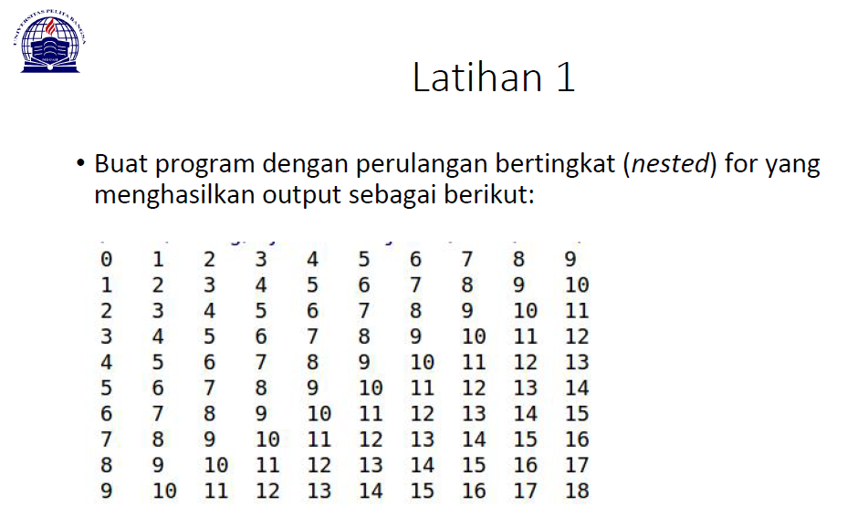
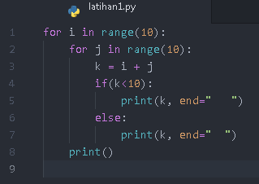
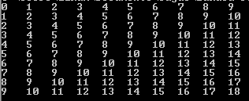
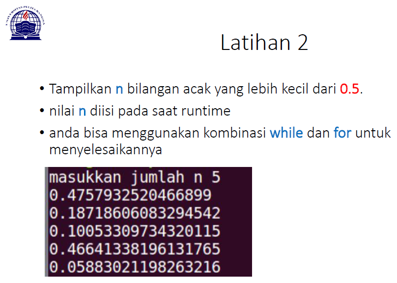
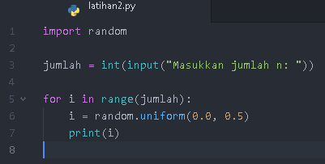

# LAB 3

## LATIHAN 1



### JAWABAN
  - Buka text editor, PyCharm, Atom, Visual Studio, dan lain-lain. Kemudian salin kode berikut


        1 for i in range(10):
        2     for j in range(10):
        3         k = i + j
        4         if(k<10):
        5             print(k, end="   ")
        6         else:
        7             print(k, end="  ")
        8     print()
        9


  

  - Kemudian simpan dengan nama ```latihan1.py```, lalu jalankan program tersebut. Maka akan menampilkan output sebagai berikut

    

### PENJELASAN
  - Pada baris pertama dan ke dua program `lathan1.py`, terdapat fungsi _`for`_ yang merupakan jenis perulangan yang terhitung / _counted loop_.

  - Variabel _`i`_ dan _`j`_ pada baris ke-1 dan 2 berfungsi untuk menampung indeks. Sedangkan fungsi _`range(10)`_ berfungsi untuk membuat list antara 0 sampai 10.

  - Pada baris ke-3 nilai dari variabel _`i`_ ditambah dengan nilai dari variabel _`j`_. Kemudian disimpan pada variabel _`k`_.

  - Baris ke-4 klausa _`if`_ sebagai pemilihan kondisi, contohnya : "Jika nilai pada variabel _`k`_ hasilnya **kurang dari 10**, maka jalankan baris ke-5 program.

  - Dan di baris ke-5 merupakan lanjutan dari _`if`_ . _`print`_ untuk mencetak nilai dari variabel  _`k`_ ke layar, kemudian fungsi _`end="   "`_ untuk memberi jarak/ spasi 3 kali ke kanan.

  - Program berjalan dan terus melakukan _looping_. Namun jika perintah pada baris ke-4 tidak terpenuhi / nilai _`k`_ **lebih besar dari 10**, Maka program akan lompat ke baris-6.

  - Di baris ke-6 klausa _`else`_ sebagai jalan terakhir apabila klausa _`if`_ tidak terpenuhi.

  - Baris ke-7 merupakan lanjutan dari _`else`_ . _`print`_ untuk mencetak nilai dari variabel  _`k`_ ke layar, kemudian fungsi _`end="  "`_ untuk memberi jarak/ spasi 2 kali ke kanan.

  - Baris ke-8, _`print()`_ berfungsi apabila perulangan pertama pada variabel _`i`_ telah dilakukan, maka tampilkan ke layar. contohnya


        0   1   2   3   4   5   6   7   8   9

*  Program akan terus melakukan _looping_ dari baris pertama hingga ke-8, sampai nilai dari variabel _`i`_ telah mencapai list ke-10.


        0   1   2   3   4   5   6   7   8   9
        1   2   3   4   5   6   7   8   9  10
        2   3   4   5   6   7   8   9  10  11
        3   4   5   6   7   8   9  10  11  12
        4   5   6   7   8   9  10  11  12  13
        5   6   7   8   9  10  11  12  13  14
        6   7   8   9  10  11  12  13  14  15
        7   8   9  10  11  12  13  14  15  16
        8   9  10  11  12  13  14  15  16  17
        9  10  11  12  13  14  15  16  17  18


## LATIHAN 2



### JAWABAN
  - Buka text editor, PyCharm, Atom, Visual Studio, dan lain-lain. Kemudian salin kode berikut


        1   import random
        2
        3   jumlah = int(input("Masukkan jumlah n: "))
        4
        5   for i in range(jumlah):
        6       i = random.uniform(0.0, 0.5)
        7       print(i)
        8



  - Kemudian simpan dengan nama ```latihan2.py```, lalu jalankan program tersebut. Maka akan menampilkan output sebagai berikut

  

### PENJELASAN
  - Pada baris pertama program `latihan2.py`, tertulis _`import random`_ yang berarti kita meng-impor modul/ _library_ bawaan dari python bernama **random**. Modul ini berisi bilangan acak, dengan bentuk **float**.

  - Baris ke-3 mendeklarasikan _`jumlah`_ sebagai variabel untuk menyimpan nilai/ jumlah yang akan kita masukkan nanti. Dan _`int`_ merubah bentuknya yang sebelumnya _string_ menjadi _integer_.

  - Baris ke-5 _`for`_ merupakan perulangan, dan _`i`_ untuk menampung indeks. _`range(jumlah)`_ sebagai list akan mengikuti jumlah yang kita masukkan pada baris ke-3.

  - Baris ke-6, mendeklarasikan kembali variabel _`i`_, dan _`random.uniform(0.0, 0.5)`_ untuk menampilkan nilai acak dari yang telah di tentukan, yaitu antara **0.0** sampai **0.5**

  - Baris ke-7, _`print(i)`_ untuk menampilkan nilai acak dari _`i`_ di baris-6 ke layar.

  - Kemudian program akan terus berulang sampai nilai dari **jumlah** yang kita inputkan tadi terpenuhi.
